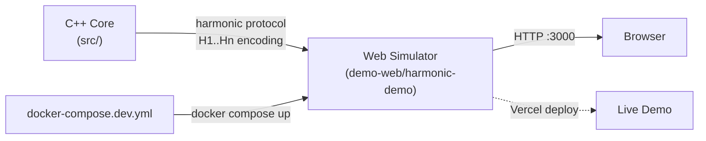

# Harmonic IoT Protocol

**EN** | [](README.pt.md)

[](https://creativecommons.org/licenses/by-nc-sa/4.0/)
[](CHANGELOG.md)
[](#)
[](docs/)
[](ROADMAP.md)
[](https://hubstry-harmonic-protocol.vercel.app/)

An innovative communication protocol for IoT and embedded systems based on the mathematical principles of the musical harmonic series.

## **[Try the Live Demo →](https://hubstry-harmonic-protocol.vercel.app/)**

Experience the Harmonic IoT Protocol in action with our interactive web simulator. Visualize harmonic frequencies, test channel mapping, and explore the mathematical foundations of the protocol.

## Project Overview

The **Harmonic IoT Protocol** uses harmonic frequencies as literal information carriers, where each harmonic subdivision (H1, H2, ..., Hn) receives a unique identifier and is mapped to specific system functions like sensors, actuators, control, or security. This enables multichannel and omnichannel communication, integrating different interfaces such as BLE, LoRa, and Wi-Fi.

## Key Features

- **Mathematical Robustness**: Predictable, interference-resistant communication channels
- **Enhanced Security**: Harmonic signatures and spectral cryptography
- **Infinite Scalability**: New devices can be added by assigning them to new harmonic channels
- **Omnichannel Integration**: Unifies BLE, LoRa, Wi-Fi, and other communication technologies
- **Native Efficiency**: Optimized for digital signal processing and Fourier analysis

## Architecture



## Repository Structure

```
├── src/                          # C++ proof-of-concept implementation
│   ├── main.cpp                 # Harmonic protocol PoC (FFT encoding/decoding)
│   └── CMakeLists.txt           # Build configuration (C++17)
├── demo-web/harmonic-demo/      # Next.js 15 interactive simulator
│   └── Dockerfile               # Multi-stage build (standalone output)
├── docker-compose.dev.yml       # Dev: single web service on :3000
├── docker-compose.production.yml # Prod: app + optional profiles (proxy/db/observability)
├── nginx/nginx.conf             # Nginx stub (active with --profile proxy)
├── docs/                        # Detailed documentation (EN + PT)
├── sdk/                         # Raspberry Pi Python SDK
├── cybersecurity/               # Security research & PQC implementation
└── .github/workflows/           # CI/CD pipelines
```

## Quick Start

### Mode 1 — C++ PoC (protocol proof-of-concept)

**Prerequisites:** C++ compiler (GCC, Clang, or MSVC), CMake 3.10+

```bash
cd src
mkdir build && cd build
cmake ..
make
./harmonic_protocol
```

### Mode 2 — Dev local (Next.js hot-reload)

**Prerequisites:** Node.js 18+

```bash
cd demo-web/harmonic-demo
npm install
npm run dev
# Open http://localhost:3000
```

### Mode 3 — Docker dev (single command)

**Prerequisites:** Docker + Docker Compose

```bash
cp .env.example .env
docker compose -f docker-compose.dev.yml up --build
# Open http://localhost:3000
```

> **Note on automated tests:** No test suite exists yet in `demo-web/harmonic-demo/`
> (`__tests__/` and `jest.config.*` are absent). Tests are a pending roadmap item.

## Web Simulator

For a more interactive experience, try our **[web-based simulator](https://hubstry-harmonic-protocol.vercel.app/)** that demonstrates:
- Real-time harmonic frequency visualization
- Interactive channel mapping
- FFT analysis and signal processing
- Mathematical foundations exploration

## Core Concepts

- **Musical Harmonic Series**: Creates unique and predictable communication channels
- **Fundamental Frequency (f₀)**: Establishes the system's base frequency
- **Harmonic Subdivisions**: Multiples of f₀ (2f₀, 3f₀, etc.) function as specific channels
- **Harmonic Multiplexing**: Enables simultaneous communication across multiple harmonics
- **Harmonic Omnichannel**: Integrates different communication interfaces through harmonic modulation

## Applications

- **Cybersecurity**: Harmonic signatures, spectral cryptography, intrusion detection
- **Precision Agriculture**: Multi-sensor coordination with interference resistance
- **Smart Cities**: Scalable IoT infrastructure with unified communication
- **Industry 4.0**: Robust industrial automation and monitoring

**Explore these applications interactively in our [web simulator](https://hubstry-harmonic-protocol.vercel.app/)**

## Testing

Comprehensive test cases are available in `docs/Tests.md`, covering:
- Functional requirements validation
- Non-functional performance testing
- Implementation verification

## Documentation

Comprehensive documentation is available in multiple languages:

### English Documentation
- **[Product Requirements](docs/en/PRD.md)**: Complete technical specifications
- **[Test Cases](docs/en/Tests.md)**: Validation and testing procedures
- **[Contributing Guide](CONTRIBUTING.md)**: Development guidelines
- **[Security Policy](SECURITY.md)**: Security practices and vulnerability reporting
- **[Roadmap](ROADMAP.md)**: Future development plans

### Portuguese Documentation
- **[Requisitos do Produto](docs/pt/PRD.md)**: Especificações técnicas completas
- **[Casos de Teste](docs/pt/Tests.md)**: Procedimentos de validação e teste
- **[Guia de Contribuição](CONTRIBUTING.pt.md)**: Diretrizes de desenvolvimento

### Project Information
- **[Changelog](CHANGELOG.md)**: Version history and updates
- **[Code of Conduct](CODE_OF_CONDUCT.md)**: Community guidelines

## Contributing

This is a proprietary technology developed by Hubstry Deep Tech. For discussions about investment, partnerships, or technical collaborations, please contact:

**Email**: guilhermemachado.ceo@hubstry.dev

## License

[](https://creativecommons.org/licenses/by-nc-sa/4.0/)

This work is licensed under the [Creative Commons Attribution-NonCommercial-ShareAlike 4.0 International License](https://creativecommons.org/licenses/by-nc-sa/4.0/).

**Copyright (c) 2025 Guilherme Gonçalves Machado**

## Tags

#DeepTech #IoT #Innovation #VentureCapital #MusicTech #EmbeddedSystems #Cybersecurity #StartupLife #TechEntrepreneur #HarmonicCommunication #AngelInvestor #VC #CVC #VentureBuilder #TechInnovation #PropietaryTechnology #MathematicalInnovation #WirelessCommunication

---

**Hubstry Deep Tech** - Transforming IoT Communication Through Mathematical Innovation
