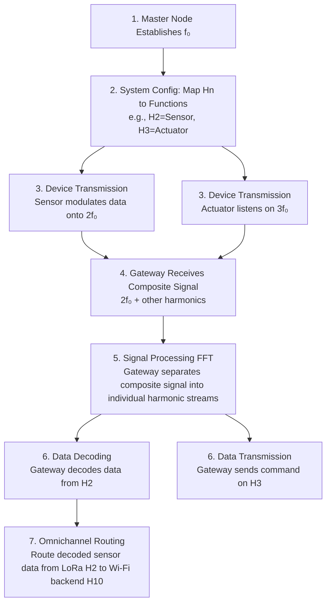

# Harmonic IoT Protocol - Product Requirements Document

## 1. Glossary/Thesaurus
- **Harmonic Protocol:** The name of the communication protocol.
- **f₀ (Fundamental Frequency):** The base frequency of the system, acting as the root of the harmonic series.
- **Harmonic Subdivisions (Hn):** Integer multiples of the fundamental frequency (2f₀, 3f₀, ...), where 'n' is the harmonic number. Each Hn serves as a unique communication channel.
- **Harmonic Multiplexing:** The technique of transmitting multiple data streams simultaneously on different harmonic channels over the same medium.
- **Harmonic Omnichannel:** The integration and routing of communications across different physical network interfaces (e.g., BLE, LoRa, Wi-Fi) by mapping them to specific harmonic channels.
- **Harmonic Signature:** A unique "fingerprint" for a device or communication type, based on its specific use of harmonics, used for identification and security.
- **Spectral Cryptography:** An encryption method where information is encoded not just in the data payload but in the selection, pattern, or modulation of the harmonic frequencies themselves.

## 2. System/Service Overview
The Harmonic IoT Protocol is an innovative communication framework for IoT and embedded systems that uses the mathematical principles of the musical harmonic series as its foundation. Instead of competing for a single frequency band, devices communicate on dedicated "harmonic channels," which are integer multiples of a system-wide fundamental frequency (f₀). This allows for a highly organized, multi-channel communication system that is inherently robust, scalable, and secure. The protocol integrates various physical interfaces (BLE, LoRa, Wi-Fi) into a unified omnichannel network, managed through harmonic assignments.

### 2.1. Mission
To create a mathematically robust, highly secure, and infinitely scalable communication protocol for the Internet of Things, inspired by the universal principles of harmony.

### 2.2. Proposed Value
- **Mathematical Robustness:** Provides predictable, interference-resistant communication channels.
- **Enhanced Security:** Enables novel security paradigms like harmonic signatures and spectral cryptography.
- **Infinite Scalability:** New devices or functions can be added by simply assigning them to new harmonic channels.
- **Omnichannel Integration:** Natively unifies disparate communication technologies like BLE, LoRa, and Wi-Fi.
- **Native Efficiency:** Perfectly suited for digital signal processing and Fourier analysis, potentially reducing computational overhead.

## 3. User Roles
- **Embedded Systems Developer:** Implements the protocol on IoT device firmware, assigning device functions (sensors, actuators) to specific harmonic channels.
- **Network Architect:** Designs and configures the overall IoT network, defining the fundamental frequency (f₀) and managing harmonic channel allocation.
- **Cybersecurity Specialist:** Develops and monitors security policies by leveraging harmonic signatures and detecting unauthorized spectral activity.
- **Data Scientist/Analyst:** Uses the clean, demultiplexed data streams for analysis in applications like precision agriculture or Industry 4.0.

## 4. Detailed Operations/Workflows

## 5. Functional Requirements
- **FR1: Fundamental Frequency (f₀) Configuration:** The system must allow a designated master node to establish, broadcast, and synchronize the `f₀` across the network.
- **FR2: Harmonic Channel Mapping:** The system must provide a dynamic registry or static configuration method to map harmonic identifiers (Hn) to specific device IDs, functions (e.g., 'read_temp'), or groups.
- **FR3: Harmonic Encoding/Modulation:** End-devices must be able to encode data and modulate it onto their assigned harmonic frequency (Hn * f₀).
- **FR4: Harmonic Demultiplexing/Decoding:** Gateway devices must be capable of receiving a composite signal and using Fast Fourier Transform (FFT) or equivalent methods to isolate and decode data from individual harmonic channels.
- **FR5: Omnichannel Integration:** The protocol must define a standard for routing data packets between different physical layers (e.g., BLE, LoRa) based on their harmonic channel assignment.
- **FR6: Security - Harmonic Signature:** The system must be able to authenticate devices based on their unique "harmonic signature" (the specific combination or quality of harmonics they use).
- **FR7: Security - Spectral Intrusion Detection:** The system must be able to monitor the frequency spectrum for unauthorized or anomalous harmonic activity, flagging it as a potential intrusion.

## 6. Non-Functional Requirements
- **NFR1: Robustness:** The protocol must maintain a bit error rate lower than standard protocols in environments with known radio frequency interference.
- **NFR2: Scalability:** The architecture must support the addition of at least 1,000 harmonic channels without significant degradation in performance.
- **NFR3: Real-time Performance:** The end-to-end latency for a single harmonic transmission (encoding -> transmission -> decoding) must be under 50ms for critical control applications.
- **NFR4: Compatibility:** The protocol's implementation must be compatible with standard microcontrollers (e.g., ARM Cortex-M series, ESP32) and radio transceivers.

## 7. Data Specifications
- **DS1: Proof-of-Concept Implementation:** The initial development will be based on the provided C++ prototype.
- **DS2: Documentation:** Detailed documentation of the protocol, including the mathematical foundations and implementation guidelines, will be maintained in a dedicated `docs/` directory.
