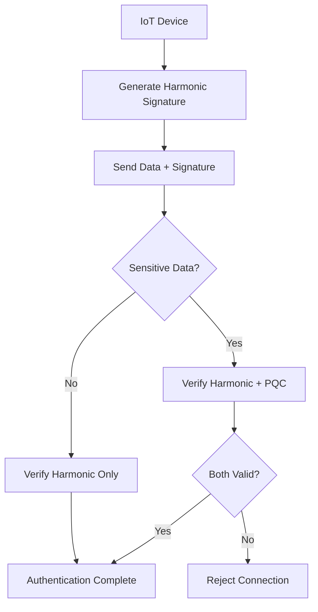

# Post-Quantum Cryptography (PQC) Security Guide

**EN** | [](../pt/Guia-Seguranca-PQC.md)

## Overview

This guide provides comprehensive instructions for implementing Post-Quantum Cryptography (PQC) in the Harmonic IoT Protocol, creating a hybrid architecture that combines innovative harmonic security with quantum-resistant protection.

## 1. When to Use PQC?

### Sensitive Data Requiring PQC
- **User credentials**: Passwords, authentication tokens
- **Master keys**: Primary system encryption keys
- **Personal data**: PII information under GDPR regulation
- **Critical configurations**: System security parameters
- **Administrative communications**: Control and configuration commands

### Data Using Only Harmonic Security
- **Sensor data**: Temperature, humidity, pressure readings
- **Device telemetry**: Operational status, performance metrics
- **Generalized location data**: Approximate coordinates
- **System logs**: Non-sensitive operational events

## 2. NIST Approved Algorithms

### Recommended Algorithms
```yaml
# Recommended PQC Configuration
encryption:
  primary: "CRYSTALS-Kyber-768"    # Public key encryption
  backup: "CRYSTALS-Kyber-1024"   # For ultra-sensitive data

digital_signatures:
  primary: "CRYSTALS-Dilithium3"   # Digital signatures
  backup: "SPHINCS+-SHA256-128s"  # Backup for critical cases

key_exchange:
  primary: "Kyber768"              # Key exchange
  classical_hybrid: "X25519+Kyber768"  # Classical+PQC hybrid
```

### Security Levels
- **Level 1**: Equivalent to AES-128 (basic IoT devices)
- **Level 3**: Equivalent to AES-192 (enterprise applications)
- **Level 5**: Equivalent to AES-256 (ultra-critical data)

## 3. Integration with Harmonic Signatures

### Hybrid Architecture
```python
# Hybrid Implementation Example
class HybridHarmonicSecurity:
    def __init__(self, fundamental_freq=1000):
        self.harmonic_auth = HarmonicAuthenticator(fundamental_freq)
        self.pqc_engine = PQCEngine(algorithm="Kyber768")

    def authenticate_device(self, device_id, harmonic_signature, sensitive_data=None):
        # 1. Harmonic authentication (always)
        harmonic_valid = self.harmonic_auth.verify_signature(
            device_id, harmonic_signature
        )

        if not harmonic_valid:
            return False

        # 2. PQC only for sensitive data
        if sensitive_data:
            pqc_valid = self.pqc_engine.verify_sensitive_data(
                device_id, sensitive_data
            )
            return harmonic_valid and pqc_valid

        return harmonic_valid

    def encrypt_payload(self, data, sensitivity_level="normal"):
        if sensitivity_level == "sensitive":
            # Use PQC for sensitive data
            return self.pqc_engine.encrypt(data)
        else:
            # Use only harmonic modulation
            return self.harmonic_auth.modulate_data(data)
```

### Hybrid Authentication Flow


## 4. Practical Implementation

### ESP32 Device Configuration
```cpp
// ESP32 with Hybrid Security
#include <HarmonicIoT.h>
#include <PQCrypto.h>

class ESP32HybridDevice {
private:
    HarmonicDevice harmonic;
    PQCEngine pqc;

public:
    void setup() {
        // Initialize harmonic security
        harmonic.init(1000.0); // f₀ = 1kHz

        // Initialize PQC only if needed
        if (has_sensitive_data()) {
            pqc.init(PQC_KYBER768);
        }
    }

    void send_sensor_data(float temperature) {
        // Sensor data: harmonic only
        HarmonicPacket packet;
        packet.data = temperature;
        packet.signature = harmonic.generate_signature(packet.data);

        transmit_harmonic(packet);
    }

    void send_credentials(String username, String password) {
        // Credentials: harmonic + PQC
        SensitivePacket packet;
        packet.encrypted_data = pqc.encrypt(username + ":" + password);
        packet.harmonic_signature = harmonic.generate_signature(packet.encrypted_data);

        transmit_secure(packet);
    }
};
```

### Raspberry Pi Gateway Configuration
```python
# Raspberry Pi Gateway with Hybrid Validation
from harmonic_iot import HarmonicDevice
from pqcrypto import PQCEngine

class HybridGateway:
    def __init__(self):
        self.harmonic = HarmonicDevice(fundamental_freq=1000)
        self.pqc = PQCEngine(algorithm="Kyber768")
        self.anomaly_detector = AnomalyDetector()

    def process_incoming_data(self, packet):
        # Detect anomalies first
        if self.anomaly_detector.is_suspicious(packet):
            self.alert_security_team("Suspicious packet detected")
            return False

        # Verify harmonic signature
        if not self.harmonic.verify_signature(packet.harmonic_signature):
            return False

        # If contains sensitive data, verify PQC
        if packet.has_sensitive_data():
            if not self.pqc.decrypt_and_verify(packet.encrypted_data):
                return False

        return True
```

## 5. Quantum Anomaly Detection

### Attack Patterns to Detect
```python
class QuantumAnomalyDetector:
    def __init__(self):
        self.baseline_metrics = self.load_baseline()

    def detect_quantum_attack_patterns(self, network_traffic):
        anomalies = []

        # 1. Mass key breaking attempts
        if self.detect_key_breaking_attempts(network_traffic):
            anomalies.append("QUANTUM_KEY_ATTACK")

        # 2. Suspicious harmonic interference patterns
        if self.detect_harmonic_interference(network_traffic):
            anomalies.append("HARMONIC_MANIPULATION")

        # 3. Bulk decryption attempts
        if self.detect_bulk_decryption_attempts(network_traffic):
            anomalies.append("BULK_CRYPTO_ATTACK")

        return anomalies

    def respond_to_quantum_threat(self, threat_type):
        if threat_type == "QUANTUM_KEY_ATTACK":
            # Rotate PQC keys immediately
            self.emergency_key_rotation()

        elif threat_type == "HARMONIC_MANIPULATION":
            # Change fundamental frequency
            self.emergency_frequency_change()

        # Alert security team
        self.escalate_to_security_team(threat_type)
```

## 6. IoT Device Optimization

### Performance Strategies
```python
# Low Power Optimizations
class OptimizedPQC:
    def __init__(self, device_class="low_power"):
        if device_class == "low_power":
            # Use lighter algorithms
            self.algorithm = "Kyber512"  # Smaller than Kyber768
            self.cache_size = 10         # Limited cache

        elif device_class == "standard":
           l is_valid;
    } key_cache;

    static constexpr uint32_t CACHE_VALIDITY_MS = 300000; // 5 minutes

public:
    // Lightweight authentication for ESP32
    bool authenticateMessage(const uint8_t* message, size_t len,
                           const uint8_t* harmonic_signature,
                           const uint8_t* pqc_signature = nullptr) {

        // Always validate harmonic signature (fast)
        if (!validateHarmonicSignature(message, len, harmonic_signature)) {
            return false;
        }

        // PQC validation only if signature provided and resources available
        if (pqc_signature && hasAvailableResources()) {
            return validatePQCSignature(message, len, pqc_signature);
        }

        return true; // Harmonic validation sufficient for basic operations
    }

private:
    bool hasAvailableResources() {
        // Check available heap and CPU
        return (esp_get_free_heap_size() > 50000) &&
               (getCPUUsage() < 80);
    }

    bool validatePQCSignature(const uint8_t* message, size_t len,
                            const uint8_t* signature) {
        // Use cached keys when possible
        if (key_cache.is_valid &&
            (millis() - key_cache.cache_timestamp) < CACHE_VALIDITY_MS) {
            return fastPQCVerify(message, len, signature, key_cache.cached_shared_secret);
        }

        // Full PQC verification (expensive)
        return fullPQCVerify(message, len, signature);
    }
};
```

### Raspberry Pi Implementation

```python
# Python implementation for Raspberry Pi
class RaspberryPiHybridSecurity:
    def __init__(self):
        self.harmonic_auth = HarmonicAuthenticator()
        self.pqc_engine = PQCEngine()
        self.anomaly_detector = SpectralAnomalyDetector()

    def authenticate_device(self, device_message):
        """
        Hybrid authentication for Raspberry Pi devices
        """
        # Step 1: Harmonic authentication (always)
        harmonic_result = self.harmonic_auth.validate(
            device_message.harmonic_signature,
            device_message.frequency_pattern,
            device_message.device_id
        )

        # Step 2: Spectral anomaly detection
        anomaly_score = self.anomaly_detector.analyze(
            device_message.frequency_spectrum
        )

        # Step 3: PQC validation for sensitive operations
        pqc_result = True
        if device_message.is_sensitive:
            pqc_result = self.pqc_engine.verify_signature(
                device_message.payload,
                device_message.pqc_signature,
                device_message.device_public_key
            )

        return {
            'authenticated': harmonic_result and pqc_result,
            'harmonic_valid': harmonic_result,
            'pqc_valid': pqc_result,
            'anomaly_score': anomaly_score,
            'trust_level': self._calculate_trust_level(
                harmonic_result, pqc_result, anomaly_score
            )
        }

    def _calculate_trust_level(self, harmonic_valid, pqc_valid, anomaly_score):
        """Calculate overall trust level (0-100)"""
        base_trust = 0

        if harmonic_valid:
            base_trust += 60  # Harmonic auth provides good base trust

        if pqc_valid:
            base_trust += 30  # PQC adds additional assurance

        # Reduce trust based on anomaly score
        anomaly_penalty = min(anomaly_score * 20, 40)

        return max(0, base_trust - anomaly_penalty)
```

## 🔍 Spectral Anomaly Detection

### Advanced Threat Detection

```cpp
class SpectralAnomalyDetector {
private:
    struct FrequencyProfile {
        double expected_frequency;
        double tolerance;
        std::vector<double> harmonic_ratios;
        double signal_strength_baseline;
    };

    std::map<std::string, FrequencyProfile> device_profiles;

public:
    enum class AnomalyType {
        FREQUENCY_DRIFT,
        SIGNAL_STRENGTH_ANOMALY,
        HARMONIC_DISTORTION,
        JAMMING_DETECTED,
        SPOOFING_ATTEMPT
    };

    struct AnomalyResult {
        bool anomaly_detected;
        AnomalyType type;
        double confidence_score;
        std::string description;
    };

    AnomalyResult analyzeSpectrum(const std::string& device_id,
                                const std::vector<double>& frequency_spectrum,
                                double fundamental_frequency) {

        AnomalyResult result;
        result.anomaly_detected = false;
        result.confidence_score = 0.0;

        // Get or create device profile
        auto& profile = getDeviceProfile(device_id, fundamental_frequency);

        // Check frequency drift
        double frequency_error = std::abs(fundamental_frequency - profile.expected_frequency);
        if (frequency_error > profile.tolerance) {
            result.anomaly_detected = true;
            result.type = AnomalyType::FREQUENCY_DRIFT;
            result.confidence_score = std::min(frequency_error / profile.tolerance, 1.0);
            result.description = "Fundamental frequency drift detected";
            return result;
        }

        // Check harmonic ratios
        auto harmonic_ratios = extractHarmonicRatios(frequency_spectrum);
        double harmonic_deviation = calculateHarmonicDeviation(harmonic_ratios, profile.harmonic_ratios);

        if (harmonic_deviation > 0.1) { // 10% threshold
            result.anomaly_detected = true;
            result.type = AnomalyType::HARMONIC_DISTORTION;
            result.confidence_score = std::min(harmonic_deviation / 0.1, 1.0);
            result.description = "Harmonic pattern deviation detected";
            return result;
        }

        // Check for jamming signals
        if (detectJamming(frequency_spectrum, fundamental_frequency)) {
            result.anomaly_detected = true;
            result.type = AnomalyType::JAMMING_DETECTED;
            result.confidence_score = 0.9;
            result.description = "Potential jamming signal detected";
            return result;
        }

        return result;
    }

private:
    bool detectJamming(const std::vector<double>& spectrum, double f0) {
        // Look for strong signals at non-harmonic frequencies
        for (size_t i = 0; i < spectrum.size(); ++i) {
            double frequency = i * (SAMPLE_RATE / spectrum.size());

            // Skip harmonic frequencies
            if (isHarmonicFrequency(frequency, f0)) continue;

            // Check for unusually strong non-harmonic signals
            if (spectrum[i] > JAMMING_THRESHOLD) {
                return true;
            }
        }
        return false;
    }
};
```

## 📊 Performance Benchmarks

### Algorithm Performance on IoT Devices

| Algorithm | ESP32 (240MHz) | Raspberry Pi 4 | Desktop CPU |
|-----------|----------------|----------------|-------------|
| **Kyber-768 KeyGen** | 45ms | 8ms | 0.5ms |
| **Kyber-768 Encaps** | 52ms | 9ms | 0.6ms |
| **Kyber-768 Decaps** | 48ms | 8ms | 0.5ms |
| **Dilithium-3 Sign** | 180ms | 25ms | 2ms |
| **Dilithium-3 Verify** | 95ms | 12ms | 1ms |
| **Harmonic Auth** | 5ms | 1ms | 0.1ms |

### Memory Requirements

| Component | RAM Usage | Flash Usage |
|-----------|-----------|-------------|
| **Kyber-768** | 12KB | 45KB |
| **Dilithium-3** | 8KB | 35KB |
| **Harmonic Auth** | 2KB | 8KB |
| **Combined System** | 22KB | 88KB |

## 🛠️ Implementation Examples

### Complete Device Authentication

```cpp
// Complete example: Device registration with hybrid security
class SecureDeviceRegistration {
public:
    struct RegistrationData {
        std::string device_id;
        std::vector<uint8_t> pqc_public_key;
        HarmonicProfile harmonic_profile;
        std::vector<uint8_t> registration_signature;
    };

    bool registerDevice(const RegistrationData& data) {
        // Step 1: Validate harmonic profile
        if (!validateHarmonicProfile(data.harmonic_profile)) {
            return false;
        }

        // Step 2: Verify PQC signature on registration data
        auto registration_payload = serializeRegistrationData(data);
        if (!DilithiumSignature::verify(
            data.registration_signature.data(),
            data.registration_signature.size(),
            registration_payload.data(),
            registration_payload.size(),
            data.pqc_public_key.data())) {
            return false;
        }

        // Step 3: Store device credentials securely
        return storeDeviceCredentials(data);
    }

private:
    bool validateHarmonicProfile(const HarmonicProfile& profile) {
        // Validate that harmonic profile is mathematically consistent
        return (profile.fundamental_frequency > 0) &&
               (profile.harmonic_channels.size() > 0) &&
               (profile.signal_strength > MIN_SIGNAL_STRENGTH);
    }
};
```

## 🔧 Configuration Guidelines

### Security Level Configuration

```yaml
# security_config.yaml
pqc_security:
  # Algorithm selection
  key_encapsulation: "kyber-768"  # Balance of security/performance
  digital_signature: "dilithium-3"  # NIST recommended

  # Sensitivity classification
  sensitive_data_types:
    - "user_credentials"
    - "master_keys"
    - "financial_data"
    - "personal_information"
    - "admin_commands"

  # Device-specific settings
  device_profiles:
    esp32:
      enable_pqc: true
      cache_keys: true
      max_signature_operations_per_minute: 10

    raspberry_pi:
      enable_pqc: true
      cache_keys: true
      max_signature_operations_per_minute: 100

    gateway:
      enable_pqc: true
      cache_keys: false  # Always use fresh keys
      max_signature_operations_per_minute: 1000

# Anomaly detection thresholds
anomaly_detection:
  frequency_drift_tolerance: 0.1  # 0.1% tolerance
  harmonic_deviation_threshold: 0.05  # 5% threshold
  jamming_detection_sensitivity: 0.8

# Performance optimization
performance:
  key_cache_duration_minutes: 5
  signature_batch_size: 10
  async_verification: true
```

## 🚀 Migration Strategy

### Gradual PQC Adoption

1. **Phase 1**: Deploy harmonic authentication (already quantum-resistant)
2. **Phase 2**: Add PQC for new sensitive operations
3. **Phase 3**: Migrate existing sensitive data to PQC protection
4. **Phase 4**: Full hybrid deployment with anomaly detection

### Compatibility Matrix

| Device Type | Harmonic Auth | PQC Support | Recommended Config |
|-------------|---------------|-------------|-------------------|
| **ESP32** | ✅ Full | ⚠️ Limited | Harmonic + selective PQC |
| **Raspberry Pi** | ✅ Full | ✅ Full | Full hybrid security |
| **Gateway** | ✅ Full | ✅ Full | Full hybrid + anomaly detection |
| **Legacy IoT** | ✅ Full | ❌ None | Harmonic only (still secure) |

## 📚 Additional Resources

- [NIST Post-Quantum Cryptography Standards](https://csrc.nist.gov/projects/post-quantum-cryptography)
- [Harmonic Authentication Technical Specification](./Harmonic-Authentication-Spec.md)
- [IoT Security Best Practices](./IoT-Security-Best-Practices.md)
- [Performance Optimization Guide](./Performance-Optimization.md)

---

**Next Steps**: Implement the hybrid security architecture in your specific use case, starting with harmonic authentication and gradually adding PQC for sensitive operations.
