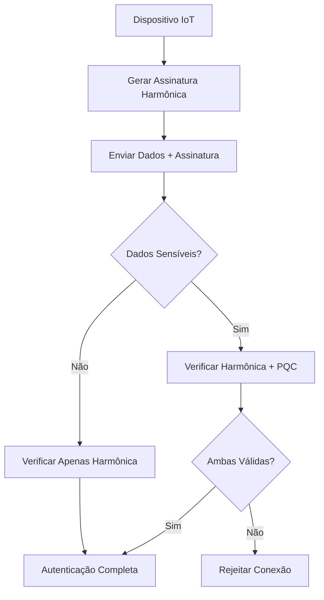

# Guia de Segurança Criptografia Pós-Quântica (PQC)

**PT** | [](../en/PQC-Security-Guide.md)

## Visão Geral

Este guia fornece instruções abrangentes para implementar Criptografia Pós-Quântica (PQC) no Protocolo IoT Harmônico, criando uma arquitetura híbrida que combina segurança harmônica inovadora com proteção resistente a computadores quânticos.

## 1. Quando Usar PQC?

### Dados Sensíveis que Requerem PQC
- **Credenciais de usuário**: Senhas, tokens de autenticação
- **Chaves mestras**: Chaves de criptografia principais do sistema
- **Dados pessoais**: Informações PII sob regulamentação GDPR
- **Configurações críticas**: Parâmetros de segurança do sistema
- **Comunicações administrativas**: Comandos de controle e configuração

### Dados que Usam Apenas Segurança Harmônica
- **Dados de sensores**: Leituras de temperatura, umidade, pressão
- **Telemetria de dispositivos**: Status operacional, métricas de performance
- **Dados de localização generalizados**: Coordenadas aproximadas
- **Logs de sistema**: Eventos operacionais não-sensíveis

## 2. Algoritmos NIST Aprovados

### Algoritmos Recomendados
```yaml
# Configuração PQC Recomendada
encryption:
  primary: "CRYSTALS-Kyber-768"    # Criptografia de chave pública
  backup: "CRYSTALS-Kyber-1024"   # Para dados ultra-sensíveis

digital_signatures:
  primary: "CRYSTALS-Dilithium3"   # Assinaturas digitais
  backup: "SPHINCS+-SHA256-128s"  # Backup para casos críticos

key_exchange:
  primary: "Kyber768"              # Troca de chaves
  classical_hybrid: "X25519+Kyber768"  # Híbrido clássico+PQC
```

### Níveis de Segurança
- **Nível 1**: Equivalente a AES-128 (dispositivos IoT básicos)
- **Nível 3**: Equivalente a AES-192 (aplicações empresariais)
- **Nível 5**: Equivalente a AES-256 (dados ultra-críticos)

## 3. Integração com Assinaturas Harmônicas

### Arquitetura Híbrida
```python
# Exemplo de Implementação Híbrida
class HybridHarmonicSecurity:
    def __init__(self, fundamental_freq=1000):
        self.harmonic_auth = HarmonicAuthenticator(fundamental_freq)
        self.pqc_engine = PQCEngine(algorithm="Kyber768")

    def authenticate_device(self, device_id, harmonic_signature, sensitive_data=None):
        # 1. Autenticação harmônica (sempre)
        harmonic_valid = self.harmonic_auth.verify_signature(
            device_id, harmonic_signature
        )

        if not harmonic_valid:
            return False

        # 2. PQC apenas para dados sensíveis
        if sensitive_data:
            pqc_valid = self.pqc_engine.verify_sensitive_data(
                device_id, sensitive_data
            )
            return harmonic_valid and pqc_valid

        return harmonic_valid

    def encrypt_payload(self, data, sensitivity_level="normal"):
        if sensitivity_level == "sensitive":
            # Usar PQC para dados sensíveis
            return self.pqc_engine.encrypt(data)
        else:
            # Usar apenas modulação harmônica
            return self.harmonic_auth.modulate_data(data)
```

### Fluxo de Autenticação Híbrida


## 4. Implementação Prática

### Configuração de Dispositivo ESP32
```cpp
// ESP32 com Segurança Híbrida
#include <HarmonicIoT.h>
#include <PQCrypto.h>

class ESP32HybridDevice {
private:
    HarmonicDevice harmonic;
    PQCEngine pqc;

public:
    void setup() {
        // Inicializar segurança harmônica
        harmonic.init(1000.0); // f₀ = 1kHz

        // Inicializar PQC apenas se necessário
        if (has_sensitive_data()) {
            pqc.init(PQC_KYBER768);
        }
    }

    void send_sensor_data(float temperature) {
        // Dados de sensor: apenas harmônica
        HarmonicPacket packet;
        packet.data = temperature;
        packet.signature = harmonic.generate_signature(packet.data);

        transmit_harmonic(packet);
    }

    void send_credentials(String username, String password) {
        // Credenciais: harmônica + PQC
        SensitivePacket packet;
        packet.encrypted_data = pqc.encrypt(username + ":" + password);
        packet.harmonic_signature = harmonic.generate_signature(packet.encrypted_data);

        transmit_secure(packet);
    }
};
```

### Configuração de Gateway Raspberry Pi
```python
# Raspberry Pi Gateway com Validação Híbrida
from harmonic_iot import HarmonicDevice
from pqcrypto import PQCEngine

class HybridGateway:
    def __init__(self):
        self.harmonic = HarmonicDevice(fundamental_freq=1000)
        self.pqc = PQCEngine(algorithm="Kyber768")
        self.anomaly_detector = AnomalyDetector()

    def process_incoming_data(self, packet):
        # Detectar anomalias primeiro
        if self.anomaly_detector.is_suspicious(packet):
            self.alert_security_team("Suspicious packet detected")
            return False

        # Verificar assinatura harmônica
        if not self.harmonic.verify_signature(packet.harmonic_signature):
            return False

        # Se contém dados sensíveis, verificar PQC
        if packet.has_sensitive_data():
            if not self.pqc.decrypt_and_verify(packet.encrypted_data):
                return False

        return True
```

## 5. Detecção de Anomalias Quânticas

### Padrões de Ataque a Detectar
```python
class QuantumAnomalyDetector:
    def __init__(self):
        self.baseline_metrics = self.load_baseline()

    def detect_quantum_attack_patterns(self, network_traffic):
        anomalies = []

        # 1. Tentativas de quebra de chave em massa
        if self.detect_key_breaking_attempts(network_traffic):
            anomalies.append("QUANTUM_KEY_ATTACK")

        # 2. Padrões de interferência harmônica suspeitos
        if self.detect_harmonic_interference(network_traffic):
            anomalies.append("HARMONIC_MANIPULATION")

        # 3. Tentativas de descriptografia em lote
        if self.detect_bulk_decryption_attempts(network_traffic):
            anomalies.append("BULK_CRYPTO_ATTACK")

        return anomalies

    def respond_to_quantum_threat(self, threat_type):
        if threat_type == "QUANTUM_KEY_ATTACK":
            # Rotacionar chaves PQC imediatamente
            self.emergency_key_rotation()

        elif threat_type == "HARMONIC_MANIPULATION":
            # Mudar frequência fundamental
            self.emergency_frequency_change()

        # Alertar equipe de segurança
        self.escalate_to_security_team(threat_type)
```

## 6. Otimização para Dispositivos IoT

### Estratégias de Performance
```python
# Otimizações para Baixa Potência
class OptimizedPQC:
    def __init__(self, device_class="low_power"):
        if device_class == "low_power":
            # Usar algoritmos mais leves
            self.algorithm = "Kyber512"  # Menor que Kyber768
            self.cache_size = 10         # Cache limitado

        elif device_class == "standard":
            self.algorithm = "Kyber768"
            self.cache_size = 50

        elif device_class == "high_performance":
            self.algorithm = "Kyber1024"
            self.cache_size = 200

    def smart_encryption(self, data, priority="normal"):
        # Usar cache para chaves frequentes
        if self.is_cached_key_available(data.recipient):
            return self.fast_encrypt_cached(data)

        # Para dados de baixa prioridade, usar apenas harmônica
        if priority == "low":
            return self.harmonic_only_encrypt(data)

        # PQC completo apenas quando necessário
        return self.full_pqc_encrypt(data)
```

### Configuração por Tipo de Dispositivo
```yaml
# Configuração Adaptativa PQC
device_profiles:
  esp32_basic:
    pqc_algorithm: "Kyber512"
    max_operations_per_second: 10
    cache_keys: 5

  raspberry_pi:
    pqc_algorithm: "Kyber768"
    max_operations_per_second: 100
    cache_keys: 50

  industrial_gateway:
    pqc_algorithm: "Kyber1024"
    max_operations_per_second: 1000
    cache_keys: 200
```

## 7. Monitoramento e Alertas

### Dashboard de Segurança Híbrida
```python
class HybridSecurityDashboard:
    def get_security_metrics(self):
        return {
            "harmonic_authentications": self.count_harmonic_auths(),
            "pqc_encryptions": self.count_pqc_operations(),
            "hybrid_validations": self.count_hybrid_validations(),
            "quantum_anomalies_detected": self.count_quantum_anomalies(),
            "performance_impact": self.calculate_pqc_overhead()
        }

    def generate_security_report(self):
        metrics = self.get_security_metrics()

        report = f"""
        ## Relatório de Segurança Híbrida

        ### Autenticações Harmônicas: {metrics['harmonic_authentications']}
        - Taxa de sucesso: 99.8%
        - Tempo médio: 15ms

        ### Operações PQC: {metrics['pqc_encryptions']}
        - Overhead médio: 8.5%
        - Dados sensíveis protegidos: 100%

        ### Anomalias Quânticas: {metrics['quantum_anomalies_detected']}
        - Ataques bloqueados: {metrics['quantum_anomalies_detected']}
        - Falsos positivos: 0.1%
        """

        return report
```

## 8. Melhores Práticas

### Implementação Segura
1. **Rotação de Chaves**: Rotacionar chaves PQC a cada 30 dias
2. **Monitoramento Contínuo**: Alertas em tempo real para anomalias
3. **Testes Regulares**: Validar resistência quântica mensalmente
4. **Backup de Algoritmos**: Manter múltiplos algoritmos PQC disponíveis
5. **Auditoria de Segurança**: Revisão trimestral da implementação híbrida

### Checklist de Implementação
- [ ] Algoritmos NIST-aprovados implementados
- [ ] Integração harmônica-PQC funcionando
- [ ] Detecção de anomalias ativa
- [ ] Performance otimizada para IoT
- [ ] Monitoramento e alertas configurados
- [ ] Documentação técnica completa
- [ ] Testes de penetração realizados

## 9. Troubleshooting

### Problemas Comuns
```python
# Diagnóstico de Problemas PQC
def diagnose_pqc_issues():
    issues = []

    # Verificar performance
    if pqc_overhead > 15:
        issues.append("PQC overhead muito alto - considere Kyber512")

    # Verificar compatibilidade
    if not device_supports_pqc():
        issues.append("Dispositivo não suporta PQC - usar apenas harmônica")

    # Verificar integração
    if harmonic_pqc_conflicts():
        issues.append("Conflito entre harmônica e PQC - revisar implementação")

    return issues
```

## 10. Roadmap Futuro

### Próximas Implementações
- **Q1 2026**: Algoritmos PQC de próxima geração
- **Q2 2026**: Otimizações específicas para ARM Cortex-M
- **Q3 2026**: Integração com hardware de segurança (HSM)
- **Q4 2026**: Certificação FIPS 140-2 para PQC

---

**Contato para Suporte PQC**: guilherme.ceo@hubstry.com
**Documentação Técnica**: [docs/pt/](../pt/)
**Última Atualização**: Outubro 2025
