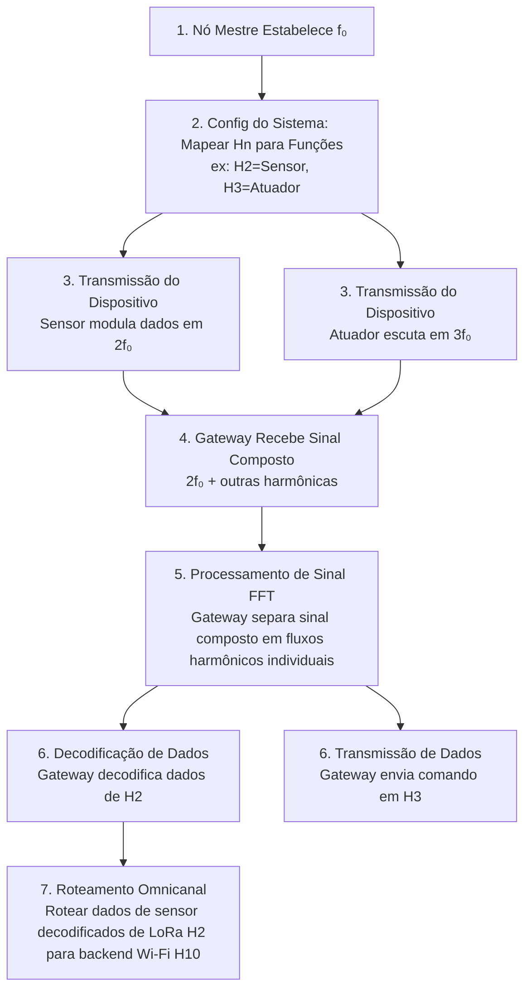

**PT** | 

# Protocolo IoT Harmônico - Documento de Requisitos do Produto

## 1. Glossário/Tesauro
- **Protocolo Harmônico:** O nome do protocolo de comunicação.
- **f₀ (Frequência Fundamental):** A frequência base do sistema, atuando como a raiz da série harmônica.
- **Subdivisões Harmônicas (Hn):** Múltiplos inteiros da frequência fundamental (2f₀, 3f₀, ...), onde 'n' é o número harmônico. Cada Hn serve como um canal de comunicação único.
- **Multiplexação Harmônica:** A técnica de transmitir múltiplos fluxos de dados simultaneamente em diferentes canais harmônicos sobre o mesmo meio.
- **Omnicanal Harmônico:** A integração e roteamento de comunicações através de diferentes interfaces de rede física (ex: BLE, LoRa, Wi-Fi) mapeando-as para canais harmônicos específicos.
- **Assinatura Harmônica:** Uma "impressão digital" única para um dispositivo ou tipo de comunicação, baseada no seu uso específico de harmônicos, usada para identificação e segurança.
- **Criptografia Espectral:** Um método de criptografia onde a informação é codificada não apenas no payload de dados, mas na seleção, padrão ou modulação das próprias frequências harmônicas.

## 2. Visão Geral do Sistema/Serviço
O Protocolo IoT Harmônico é uma estrutura de comunicação inovadora para IoT e sistemas embarcados que usa os princípios matemáticos da série harmônica musical como sua fundação. Em vez de competir por uma única banda de frequência, os dispositivos se comunicam em "canais harmônicos" dedicados, que são múltiplos inteiros de uma frequência fundamental (f₀) do sistema. Isso permite um sistema de comunicação multi-canal altamente organizado que é inerentemente robusto, escalável e seguro. O protocolo integra várias interfaces físicas (BLE, LoRa, Wi-Fi) em uma rede omnicanal unificada, gerenciada através de atribuições harmônicas.

### 2.1. Missão
Criar um protocolo de comunicação matematicamente robusto, altamente seguro e infinitamente escalável para a Internet das Coisas, inspirado nos princípios universais da harmonia.

### 2.2. Valor Proposto
- **Robustez Matemática:** Fornece canais de comunicação previsíveis e resistentes a interferências.
- **Segurança Aprimorada:** Permite novos paradigmas de segurança como assinaturas harmônicas e criptografia espectral.
- **Escalabilidade Infinita:** Novos dispositivos ou funções podem ser adicionados simplesmente atribuindo-os a novos canais harmônicos.
- **Integração Omnicanal:** Unifica nativamente tecnologias de comunicação díspares como BLE, LoRa e Wi-Fi.
- **Eficiência Nativa:** Perfeitamente adequado para processamento digital de sinais e análise de Fourier, potencialmente reduzindo a sobrecarga computacional.

## 3. Papéis de Usuário
- **Desenvolvedor de Sistemas Embarcados:** Implementa o protocolo no firmware de dispositivos IoT, atribuindo funções do dispositivo (sensores, atuadores) a canais harmônicos específicos.
- **Arquiteto de Rede:** Projeta e configura a rede IoT geral, definindo a frequência fundamental (f₀) e gerenciando a alocação de canais harmônicos.
- **Especialista em Cibersegurança:** Desenvolve e monitora políticas de segurança aproveitando assinaturas harmônicas e detectando atividade espectral não autorizada.
- **Cientista/Analista de Dados:** Usa os fluxos de dados limpos e demultiplexados para análise em aplicações como agricultura de precisão ou Indústria 4.0.

## 4. Operações/Fluxos de Trabalho Detalhados

## 5. Requisitos Funcionais
- **RF1: Configuração da Frequência Fundamental (f₀):** O sistema deve permitir que um nó mestre designado estabeleça, transmita e sincronize o `f₀` através da rede.
- **RF2: Mapeamento de Canal Harmônico:** O sistema deve fornecer um registro dinâmico ou método de configuração estática para mapear identificadores harmônicos (Hn) para IDs de dispositivos específicos, funções (ex: 'read_temp'), ou grupos.
- **RF3: Codificação/Modulação Harmônica:** Dispositivos finais devem ser capazes de codificar dados e modulá-los em sua frequência harmônica atribuída (Hn * f₀).
- **RF4: Demultiplexação/Decodificação Harmônica:** Dispositivos gateway devem ser capazes de receber um sinal composto e usar Transformada Rápida de Fourier (FFT) ou métodos equivalentes para isolar e decodificar dados de canais harmônicos individuais.
- **RF5: Integração Omnicanal:** O protocolo deve definir um padrão para rotear pacotes de dados entre diferentes camadas físicas (ex: BLE, LoRa) baseado em sua atribuição de canal harmônico.
- **RF6: Segurança - Assinatura Harmônica:** O sistema deve ser capaz de autenticar dispositivos baseado em sua "assinatura harmônica" única (a combinação específica ou qualidade de harmônicos que eles usam).
- **RF7: Segurança - Detecção de Intrusão Espectral:** O sistema deve ser capaz de monitorar o espectro de frequência para atividade harmônica não autorizada ou anômala, sinalizando-a como uma potencial intrusão.

## 6. Requisitos Não-Funcionais
- **RNF1: Robustez:** O protocolo deve manter uma taxa de erro de bit menor que protocolos padrão em ambientes com interferência de radiofrequência conhecida.
- **RNF2: Escalabilidade:** A arquitetura deve suportar a adição de pelo menos 1.000 canais harmônicos sem degradação significativa na performance.
- **RNF3: Performance em Tempo Real:** A latência fim-a-fim para uma única transmissão harmônica (codificação -> transmissão -> decodificação) deve ser menor que 50ms para aplicações de controle críticas.
- **RNF4: Compatibilidade:** A implementação do protocolo deve ser compatível com microcontroladores padrão (ex: série ARM Cortex-M, ESP32) e transceptores de rádio.

## 7. Especificações de Dados
- **ED1: Implementação Proof-of-Concept:** O desenvolvimento inicial será baseado no protótipo C++ fornecido.
- **ED2: Documentação:** Documentação detalhada do protocolo, incluindo as fundações matemáticas e diretrizes de implementação, será mantida em um diretório `docs/` dedicado.